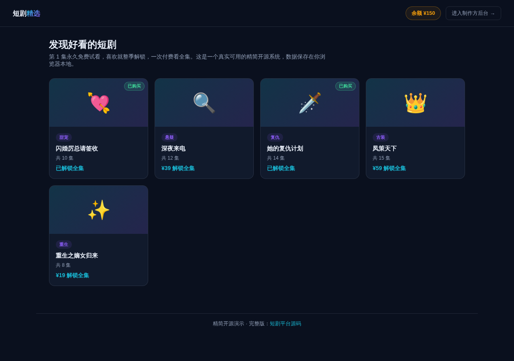

# 短剧平台系统（精简开源版）· Drama Lite

**[在线体验（前台）→](https://anna123123123-creator.github.io/drama-lite/)** · **[制作方后台 →](https://anna123123123-creator.github.io/drama-lite/admin.html)**

免费开源的短剧平台系统精简版。这不是截图或原型图，是一个**真实可用**的前后台系统：剧集目录浏览、首集免费试看、整季付费解锁（一次付费，解锁全部集数）、模拟视频播放器，后台剧集与分集增删改查、真实的收入与热销统计——都是真功能，纯前端 + `localStorage` 实现，不需要服务器、不需要数据库，克隆下来打开就能用，也适合作为学习或二次开发的起点。



## 功能

**前台（观众视角）**
- 剧集目录浏览：封面、分类、价格、集数一目了然
- 每部剧的第 1 集永久免费试看，无需付费即可观看
- 模拟视频播放器：播放/暂停按钮、随播放实时推进的进度条与时间显示、播完自动停止并提示"本集播放完毕"、可跳转下一集
- 整季解锁：一次付费解锁该剧全部集数（不是按集付费），余额不足会显示具体还差多少钱
- 已购买的剧集会显示"已购买"状态，不会重复扣费
- 顶部实时显示账户余额

**后台（制作方/运营视角）**
- 仪表盘：剧集总数、总购买数、总收入、本月收入，以及按购买次数真实聚合排序的热销剧集排行
- 剧集管理：新增、编辑、删除剧集（标题、分类、简介、整季价格），删除会级联清除对应的分集和购买记录
- 分集管理：按剧集查看有序分集列表，新增、编辑、删除分集（标题、时长、是否设为免费试看）

## 关于"模拟视频播放器"

这个 Demo 里没有真实的视频文件，也没有视频托管后端。播放器是一个**真实运行的模拟播放状态机**：点击播放后，进度条和时间显示会通过 `setInterval` 按真实节奏（每 250ms）推进，直到到达该集设定的时长后自动停止 —— 播放/暂停、进度推进、播放完毕这些交互都是真的在运行，只是画面本身是占位的，不是在解码真实视频流。生产环境需要接入真实的视频转码与 CDN 分发服务来替换这一层。

## 试用方法

克隆下来，直接用浏览器打开 `index.html`，或用静态文件服务器跑起来：

```bash
python3 -m http.server 8000
```

前台在 `index.html`，后台在 `admin.html`。所有数据存在浏览器的 `localStorage` 里（`drama_lite_data_v1` 这个 key），后台侧边栏有"重置示例数据"按钮可以随时清空重来。

## 技术说明

没有用任何框架或构建工具，纯原生 HTML/CSS/JavaScript，一共 5 个文件：`data.js`（数据层，负责 localStorage 读写和种子数据）、`index.html` + `script.js`（前台）、`admin.html` + `admin.js`（后台）。因为是纯前端 Demo，这里只模拟单一本地观众（没有真实的多用户账号体系），数据只存在当前浏览器里，不同设备/浏览器之间不会同步——真实生产系统需要一个后端 API 和数据库来替换 `data.js` 里的存储层，还需要真实的视频转码与 CDN 分发、真实的支付网关，界面和交互逻辑基本可以直接复用。

## 协议

MIT，随便怎么用都行。

## 需要定制版？

这个工具免费开源、可以直接用。如果你需要的是**改造成适合自己业务的版本**——换品牌、改字段、加功能、接后端或数据库——我可以做。

- **交付周期**：3–10 个工作日
- **交付内容**：完整源码（不加密、可自行二次开发）+ 在线地址 + 部署说明
- **已有 49 套现成系统**可直接改造，覆盖电商、教育、门店、内容、跨境等行业：[全部清单与在线演示](https://inzyxuashop.com)

把你的需求发给我，24 小时内回复可行性与报价：**evcdecd@gmail.com**
